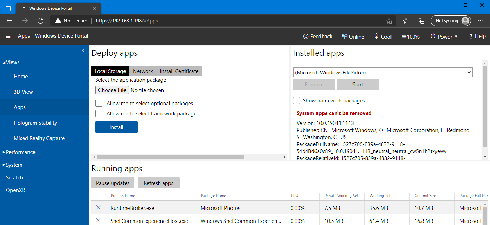

# SignCapturer

- Setup recording walk-through

## Enable For Developers

Go to `Settings -> Update & Security -> For developers` and enable the following:
1. Use developer features
2. Device discovery
3. Device portal

Now stay on this page and scroll to the bottom. You should see `Wi-Fi` and then a blue address like `https://192.168.1.198` (my address). On your computer whether that be a desktop or laptop, open one of the following: `FireFox`, `Edge`, or `Chrome`. In the address bar type in the IP address given to use by the HoloLens 2. In my case that is `192.169.1.198`, type it in as follows:

</a>

Press enter and you should then see a page as follows with small variations due to browser differences.

</a>

Click on the `Advanced` button in the bottom right, which will then show:

</a>

Click on the blue continue text with your IP address in the button's text. This will now begin the authorization part of connecting to your hololens 2 remotely.

</a>

Go ahead and enter your login information for you hololens 2 and click `Login` once ready. Afterwards you will be brought to the home page of the remote device portal, from there you will want to navigate to `Views -> Apps` as shown in the image below.

</a>

Here you will install the app (.appx) provided to you into your hololens 2 through this portal. So, make sure that `Local Storage` is clicked like shown and then click the `Choose File` button. Then navigate to the `.appx`, select it and click open. You should now see the name of the app as follows (with whatever name your appx has):

  </a>

Leave both check boxes unchecked and click install. After a few seconds you should see the following:

</a>

Now that the app is installed there are two simple ways (to my knowledge) to start the app. 

#### Method 1
Go back to your hololens and close out of `Settings`. Open up your home and go to all apps, once there locate SignCapturer and click on it. The app will start loading and takes a moment so be patient. You will know it is ready when you see a single button as shown in the following screenshot after both methods. (*if the app isn't showing up `all apps` then use method 2 as this happened to me*)

------- Or --------

#### Method 2

Alternatively on while still on the device portal `View -> Apps` page, locate the **Installed Apps** section to the right of where we have been working. Click the dropdown and search for `SignCapturer` and then select it. Once selected, click the start button and it will be launched in your hololens 2.

</a>

The result for both methods should look as follows.

</a>

Click the button on to begin recording your hand. All the visible joints on your hand are being recorded. Once done, click the button to turn off recording, and you can now close the app for the data is automatically routed to a remote server for storage.

Thank you!
